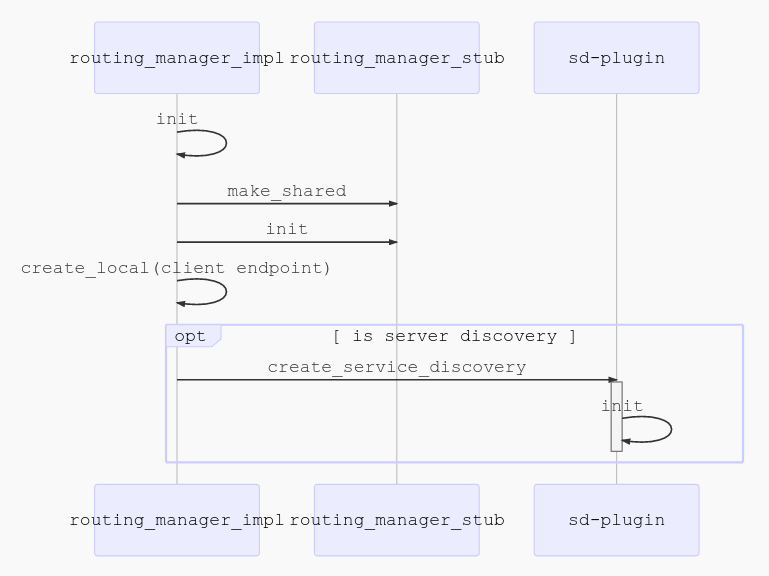
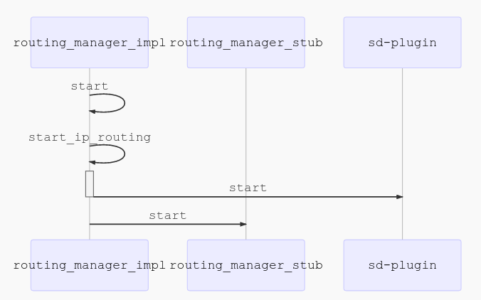

# SOMEIP 00 : vSOMEIP

* refrence: https://blog.zeerd.com/vsomeip-1st/

## Introduction
vsomeip 是GENIVI项目中的一个SOME/IP开源实现，基于Mozilla Public Liense v2.0协议开源，由BMW贡献。

vsomeip提供了两个动态库：
* SOME/IP协议的实现库libvsomeip.so
* 用于服务发现的库libvsomeip-sd.so。

vsomeip除了支持设备之间的SOME/IP通讯，也支持设备本地的进程间通讯，本地通讯通过unix socket完成。
vsomeip的实现基于boost.asio的异步IO库。
vsomeip应用通过一个Routing Manager与其他设备进行通讯，Routing Manager统一负责服务发现以及外部通讯socket的管理。
一个设备上的多个vsomeip应用共用一个Routing Manager，默认第一个启动的vsomeip应用负责启动Routing Manager，也可以通过配置指定，其他应用通过proxy与Routing Manage进行通讯。

vsomeip应用可以通过json文件来进行配置，配置项包含自身IP，应用名字，负责启动Routing Manager的应用，应用日志，服务发现的广播地址，广播间隔等。

## Code Block

vSomeIP的代码主要分成如下四大部分

* daemon

* implementation

* interface
    - runtime
    - application
    - messgae
    - payload

* tool & examples

### Interface

#### Runtime
这个类用于管理（主要是创建）其他所有公共资源和获取runtime属性。公共资源包括:

- application
- message
- request
- reponse
- notification
- payload

#### Application
这是最核心的一个部分。它在每个客户端都存在且仅存在一份。
Application可以通过Runtime的接口来实例化。
管理着vSomeIP客户端的生命周期和生命周期内的所有通讯。

##### Plugin

vSomeIP允许Application加载一到多个Plugin。
当Application的状态发生变化时，这个变化会被通知到Plugin。
在通知的时候会附带Application的名称。用于Plugin进行区别对待。

Application的状态有三种，分别为：
* Initialized
* Started
* Stopped

#### Message
无论是Request、Response还是Notification，本质上都是一种Message。

从某种意义上来说，Message可以去分成两类，分别是通用Message和服务发现相关的Message。

Message类提供了编串和解串功能，用于进行数据通讯，本质上他封装了SOME/IP的消息头。
所以，它还提供了一些列方法来设置或者读取详细的消息头信息。
这一点可以参考SOME/IP的 协议 文档。

#### Payload

Message的主体。也就是排除消息头之后剩下的部分。

## Implementation
针对Interface的实装。 

### Endpoints
每个具有vSomeIP功能的进程都是一个Endpoint。
Endpoint分成分成六大类：

- local-client
- udp-client
- tcp-client
- local-server
- udp-server
- tcp-server

### Service Discovery

#### init

```mermaid
graph TD;
    service_discovery_impl == init -.- 
    parse_confguration -.->
    service_discovery_imple;

```

#### start
```mermaid
graph TD;

service_discovery_impl
 == start 
 -.-> create_service_discovery_endpoint 
 -.-> create_server_endpoint 
 == join_sd_multicast
--> endpoint

```

### Routing

每个系统中只能有一个vSomeIP服务被配置成Routing。

如果没有特别的设定，那么系统中被运行的第一个具备vSomeIP功能的程序会被作为Routing Manager。

#### Init

#### Start

## Daemon

daemon的主体就是一个vsomeip::application

Application创建了一个routing_manager_impl的实例。
如果这不是Daemon，而是一个通常的Application，那么他会转而创建routing_manager_proxy的实例，并与找到的Routing Manager建立连接。

## Tools & Examples

一些简易的Application。用于进行一些消息发送接收的测试工作。

