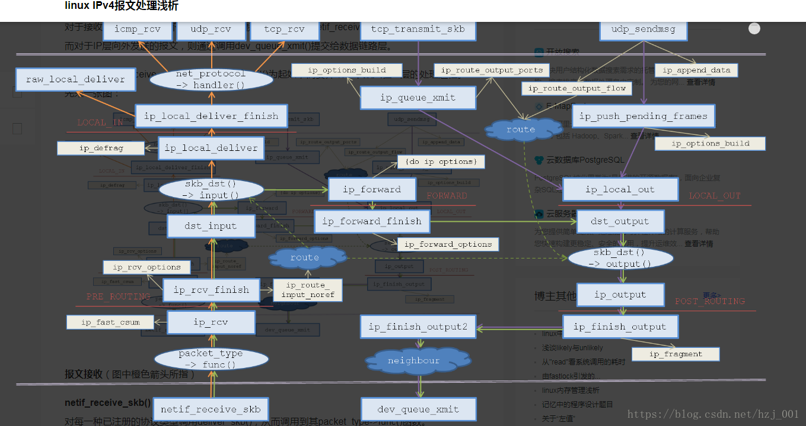

# TCP/IP 收发总体流程

## Overview
从应用层的发送流程的函数调用大致如下:
```c
 sys_sendto(用户态发包调用函数)
    --> sock_sendmsg:
    sock发包函数，调用sock中对应的协议族的发包函数
        --> inet_sendmsg:
        以太网协议栈发包函数，被赋值于对应协议族的sendmsg字段
            --> tcp_sendmsg:
            用户态发包函数，把用户层的数据，填充到skb中，然后加入到sock的发送队列
                --> tcp_push
                    -->__tcp_push_pending_frames:
                    尽可能的将发送队列中的skb发送出去，禁用nalge
                        --> tcp_write_xmit:
                        将发送队列上的SBK发送出去，返回值为0表示发送成功
                            -->tcp_transmit_skb:
                            该函数会建立IP层的头，并将该头传递给网络层
                                --> ip_queue_xmit:
                                此步骤已进入IP层了，首先为输入包建立IP包头, 经过本地包过滤器后,再将IP包分片输出(ip_fragment)
```

而 Linux 网络接受数据的流程简单总结为:

1. 网口 ---> 触发软中断  
    网卡收到网络包后，触发网卡注册的硬中断处理函数，硬中断处理函数负责触发网络收包软中断。
2. 软中断 ---> TCP  
    `open_softirq(NET_RX_SOFTIRQ, net_rx_action)`软中断处理函数调用网络收报处理函数

实际函数调用框架图:
报文发送（图中紫色箭头）:

传输层在发送报文时，会调用到IP层的接口。如：
- ip_queue_xmit()
- ip_append_data()
- ip_append_page()
- ip_push_pending_frames()
- ip_local_out()

> 这些函数最终会调用到ip_local_out()。




### 函数功能简介:

#### netif_receive_skb()
对每一种已注册的协议类型调用deliver_skb()，从而调用到其packet_type->func()函数。

对于IP协议，会调用到ip_rcv()。

#### ip_rcv()
IP报头检查，调用ip_fast_csum()检查校验和

#### netfilter
NF_INET_PRE_ROUTING;

调用ip_rcv_finish()

#### ip_rcv_finish()
调用ip_route_input_noref()查找路由表，其结果会决定报文的去向;

调用ip_rcv_options()处理IP选项;

调用dst_input()，从而调用到rtable.dst_entry->input()。
根据路由不同，主要有ip_forward（转发）、ip_local_deliver（接收）两种取值;

#### ip_local_deliver()
如果存在分片，调用ip_defrag()完成分片重组。如果分片暂未到齐则直接返回。

#### netfilter
NF_INET_LOCAL_IN;  

调用ip_local_deliver_finish()

#### ip_local_deliver_finish()
调用raw_local_deliver()试图按raw socket方式（直接收发IP报文的socket）递交给上层应用，递交成功则返回;

按ip_hdr->protocol取出相应L4协议，调用net_protocol.handler()，从而将报文提交给传输层。

主要有的L4协议handler有icmp_rcv()、udp_rcv()、tcp_v4_rcv()、等。


在此之前，报文会被构造好。可能由传输层的代码自己构造、也可能通过调用ip_append_data()这样的辅助函数来构造。


## 具体函数实现: net_rx_action()
实现如下:
```c

static __latent_entropy void net_rx_action(struct softirq_action *h)
{
	struct softnet_data *sd = this_cpu_ptr(&softnet_data);
	unsigned long time_limit = jiffies +
		usecs_to_jiffies(netdev_budget_usecs);
	int budget = netdev_budget;
	LIST_HEAD(list);
	LIST_HEAD(repoll);

	local_irq_disable();
	list_splice_init(&sd->poll_list, &list);
	local_irq_enable();

	for (;;) {
		struct napi_struct *n;

		if (list_empty(&list)) {
			if (!sd_has_rps_ipi_waiting(sd) && list_empty(&repoll))
				return;
			break;
		}

		n = list_first_entry(&list, struct napi_struct, poll_list);
		budget -= napi_poll(n, &repoll);

		/* If softirq window is exhausted then punt.
		 * Allow this to run for 2 jiffies since which will allow
		 * an average latency of 1.5/HZ.
		 */
		if (unlikely(budget <= 0 ||
			     time_after_eq(jiffies, time_limit))) {
			sd->time_squeeze++;
			break;
		}
	}

	local_irq_disable();

	list_splice_tail_init(&sd->poll_list, &list);
	list_splice_tail(&repoll, &list);
	list_splice(&list, &sd->poll_list);
	if (!list_empty(&sd->poll_list))
		__raise_softirq_irqoff(NET_RX_SOFTIRQ);

	net_rps_action_and_irq_enable(sd);
}
```


对于接收到的报文，如果不被丢弃、不被网桥转发，会调用`netif_receive_skb()`提交给IP层；

而对于IP层向外发送的报文，则通过调用`dev_queue_xmit()`提交给数据链路层。

所以从`netif_receive_skb()`和`dev_queue_xmit()`为切入点，更容易学习并了解tcp发送的处理过程.


## `netif_receive_skb()`

函数所在位置为: `linux/net/core/dev.c`

网络数据的流向是由 `drivers/net/*` 各个驱动调用 `netif_receive_skb()`, 传入 `skb` 数据;

大致调用流程如下:
```c
netif_receive_skb(skb)   
 --> netif_receive_skb_internal（skb）
    --> __netif_receive_skb_core(skb)
        --> __netif_receive_skb_one_core(skb, bool)  
            --> __netif_receive_skb_core(skb)  

```

更具体一点的代码逻辑如下:

### netif_receive_skb_internal(): 

- net_timestamp_check()
- skb_defer_rx_timestamp(skb)
- rcu_read_lock()
- __netif_receive_skb(skb)
- rcu_read_unlock()  -> TODO

### __netif_receive_skb(): 
 
* if sk_memalloc_socks() && skb_pfmemalloc(skb):

  - memalloc_noreclaim_save()
  - __netif_receive_skb_one_core(skb, true)
  - memalloc_noreclaim_restore(noreclaim_flag)

* else:

  -  __netif_receive_skb_one_core(skb, false)


### __netif_receive_skb_one_core(): 


- __netif_receive_skb_core()

- INDIRECT_CALL_INET(pt_prev->func, ipv6_rcv, ip_rcv, skb, skb->dev, pt_prev, orig_dev)


### __netif_receive_skb_core():

- net_timestamp_check(!netdev_tstamp_prequeue, skb)
- trace_netif_receive_skb(skb)
- skb_reset_network_header(skb)

- if skb_transport_header_was_set(skb): 
  - skb_reset_transport_header(skb)

- skb_reset_mac_len(skb):

- `another_round`:
  - __this_cpu_inc(softnet_data.processed): 保证数据只在当前CPU上

  - if static_branch_unlikely(&generic_xdp_needed_key):
    - migrate_disable()
    - do_xdp_generic(rcu_dereference(skb->dev->xdp_prog), skb)
    - migrate_enable()
    - if XDP_PASS else NET_RX_DROP then goto `OUT`

  - if eth_type_vlan(skb->protocol):
    - skb_vlan_untag(skb)
    - if unlikely(!skb) then goto `OUT`

	- if (skb_skip_tc_classify(skb)):
	  - goto `skip_classify`;

	- if (pfmemalloc)
	  - goto `skip_taps`;

	- list_for_each_entry_rcu(ptype, &ptype_all, list) 
	  - if (pt_prev)
		  - deliver_skb(skb, pt_prev, orig_dev);

	- list_for_each_entry_rcu(ptype, &skb->dev->ptype_all, list)
	  - if (pt_prev)
		  - deliver_skb(skb, pt_prev, orig_dev);

- `skip_taps`:
  - if `CONFIG_NET_INGRESS`:
    - if static_branch_unlikely(&ingress_needed_key):
      - nf_skip_egress(skb, true);
		  - skb = sch_handle_ingress(skb, &pt_prev, &ret, orig_dev, &another);
		  - if (another) then goto `another_round`;
		  - if (!skb) then goto `out`;
      - nf_skip_egress(skb, false);
		  - if (nf_ingress(skb, &pt_prev, &ret, orig_dev) < 0) then goto `out`;

  - skb_reset_redirect

- `skip_classify`:
	- if (pfmemalloc && !skb_pfmemalloc_protocol(skb)) then goto `drop`;

	- if skb_vlan_tag_present(skb)
		- if (pt_prev) 
			- deliver_skb(skb, pt_prev, orig_dev);
		
		 - if (vlan_do_receive(&skb) then goto `another_round`;
		 - else if (unlikely(!skb)) then goto `out`;
	

	- rx_handler = rcu_dereference(skb->dev->rx_handler);
	  - if (rx_handler) {
       - ret = deliver_skb(skb, pt_prev, orig_dev)

      - switch (rx_handler(&skb)) 
        - case RX_HANDLER_CONSUMED:
          NET_RX_SUCCESS goto `out`
        - case RX_HANDLER_ANOTHER :
          goto `another_round`;
        - case RX_HANDLER_EXACT:
          deliver_exact = true 
          break
        - case RX_HANDLER_PASS:
          break
        - default:
          BUG

- `check_vlan_id`:
  - if (skb_vlan_tag_get_id(skb)):
    skb->pkt_type = PACKET_OTHERHOST
  - else if eth_type_vlan(skb->protocol):
    - __vlan_hwaccel_clear_tag(skb);
		- skb = skb_vlan_untag(skb);
		- if (unlikely(!skb)) then goto `out`
		- if (vlan_do_receive(&skb)) goto `another_round`
		- else if (unlikely(!skb)) goto `out`
		- else goto `check_vlan_id`

  - __vlan_hwaccel_clear_tag(skb)
  - if (likely(!deliver_exact)):
		- deliver_ptype_list_skb(skb, &pt_prev, orig_dev, type, &ptype_base[ntohs(type) & PTYPE_HASH_MASK]);

	- deliver_ptype_list_skb(skb, &pt_prev, orig_dev, type, &orig_dev->ptype_specific);

	- if (unlikely(skb->dev != orig_dev)):
	  - deliver_ptype_list_skb(skb, &pt_prev, orig_dev, type, &skb->dev->ptype_specific);

	- if (pt_prev) {
		- if (unlikely(skb_orphan_frags_rx(skb, GFP_ATOMIC))) then goto `drop`;
		- *ppt_prev = pt_prev;

- `drop`:
  - if (!deliver_exact):
			atomic_long_inc(&skb->dev->rx_dropped)
	- else:
			atomic_long_inc(&skb->dev->rx_nohandler)
	- kfree_skb(skb)
	- ret = NET_RX_DROP;

- `out`:
  return 


