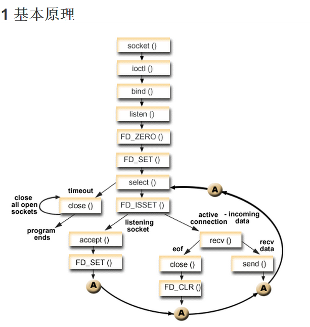

# select

## select 函数介绍
> https://man7.org/linux/man-pages/man2/select.2.html

- 同步IO多路复用

### man 3 select
#### 函数原型
```c
#include <sys/select.h>

typedef /* ... */ fd_set;

int select(int nfds, fd_set *_Nullable restrict readfds,
        fd_set *_Nullable restrict writefds,
        fd_set *_Nullable restrict exceptfds,
        struct timeval *_Nullable restrict timeout);

void FD_CLR(int fd, fd_set *set);
int  FD_ISSET(int fd, fd_set *set);
void FD_SET(int fd, fd_set *set);
void FD_ZERO(fd_set *set);
```

- `FD_ZERO() ` 

    该宏清除（从set中删除）所有文件描述符。
它应该作为初始化文件描述符集的第一步

- `FD_SET（）`

    该宏将文件描述符fd添加到set中。
将已经存在于set中的文件描述符添加到set中不会产生任何操作，并且不会产生错误。

- `FD_CLR（）`

    该宏从set中删除文件描述符fd。
从set中删除不存在的文件描述符不会产生任何操作，并且不会产生错误。

- `FD_ISSET（）` 

    select()根据下面描述的规则修改set的内容。
在调用select()之后，可以使用FD_ISSET（）宏测试文件描述符是否仍然存在于set中。
如果文件描述符fd在set中存在，则FD_ISSET（）返回非零值，如果不存在，则返回零。

#### 参数说明
##### `readfds`

在该集合中的文件描述符将被监视，以确定它们是否准备好进行读取。如果读操作不会阻塞，即文件描述符可读，则准备就绪。特别地，文件描述符在文件结束时也视为准备就绪。

在select()返回后，readfds将被清除，除了那些准备好进行读取的文件描述符。

##### `writefds`

在该集合中的文件描述符将被监视，以确定它们是否准备好进行写入。
如果写操作不会阻塞，则文件描述符准备就绪。
然而，即使文件描述符表示为可写，如果进行大量写入可能仍会阻塞。

在select()返回后，writefds将被清除，除了那些准备好进行写入的文件描述符。

##### `exceptfds`

在该集合中的文件描述符将被监视，以检测“异常条件”。
有关一些异常条件的示例，请参阅poll(2)中关于POLLPRI的讨论。

在select()返回后，exceptfds将被清除，除了发生异常条件的文件描述符。

##### `nfds`

该参数应设置为三个集合中的最高文件描述符号加1。将检查每个集合中指定的文件描述符，直到达到此限制（但请参阅BUGS）。

##### `timeout`  
timeout参数是一个timeval结构（如下所示），用于指定select()函数应该阻塞等待文件描述符准备就绪的时间间隔。调用将阻塞，直到发生以下情况之一：

* 文件描述符准备就绪；
* 调用被信号处理程序中断；
* 超时时间到期

请注意，__超时时间间隔将被调整为系统时钟粒度，并且内核调度延迟意味着阻塞时间可能会略微超过指定的时间__。

如果timeval结构的两个字段都设置为零，则select()立即返回。（这在进行轮询时很有用。）

如果timeout参数指定为NULL，则select()将无限期地阻塞，等待文件描述符准备就绪。

#### 工作流程
- 准备工作
    1. 设置文件描述符
    2. 指定监视范围
    3. 设置超时
- 调用select
- 查看调用结果

##### 基本原理
select 函数的原理流程图:


## 准备工作

##### 设置文件描述符

将需要监视的文件描述符添加到set中, 按照入参的监视项分类成:
* 接受
* 传输
* 异常

通过相应的宏进行对socket fd 的设置, 而socket fd 都是存放在fd_set 中:

```c
/* fd_set for select and pselect.  */
typedef struct {

__fd_mask __fds_bits[__FD_SETSIZE / __NFDBITS];
# define __FDS_BITS(set) ((set)->__fds_bits)

} fd_set;

/* Maximum number of file descriptors in `fd_set'.  */
#define	FD_SETSIZE		__FD_SETSIZE


/* Number of descriptors that can fit in an `fd_set'.  */
#define	__FD_SETSIZE		1024 // bits/typesizes.h
/* It's easier to assume 8-bit bytes than to get CHAR_BIT.  */
#define __NFDBITS	(8 * (int) sizeof (__fd_mask))
#define	__FD_ELT(d)	((d) / __NFDBITS)
#define	__FD_MASK(d)	((__fd_mask) (1UL << ((d) % __NFDBITS)))
```

## 局限性

### 单进程文件监控描述符数量有限，最大1024
单个进程调用 select 的 监控文件描述符集合 fd_set 有限，该结构体大小为 128 字节，每一个 bit 位可以监控一个文件描述符，
因此 select 最大可以同时监控1024个文件描述符（socket）。
对于Linux系统而言，单个进程可以打开的文件句柄默认也为1024个。
可以用 ulimit -n xxx 来设置，由于select采用轮询方式扫描文件描述符。文件描述符数量越多，性能越差。

### 内核/用户数据拷贝频繁，操作复杂
select 在调用之前，需要手动在应用程序里将要监控的文件描述符添加到 fd_set 集合中，然后加载到内核进行监控。
用户为了检测时间是否发生，还需要在用户程序手动维护一个数组，存储监控文件描述符。
当内核事件发生，在将 fd_set 集合中没有发生的文件描述符清空，然后拷贝到用户区，和数组中的文件描述符进行比对。
再调用selecct也是如此。每次调用，都需要了来回拷贝。

### 线性轮询复杂度为O(N)效率低
select 返回的是整个数组的句柄。应用程序需要遍历整个数组才知道谁发生了变化。

### 单一水平触发
应用程序如果没有完成对一个已经就绪的文件描述符进行 IO 操作。那么之后 select 调用还是会将这些文件描述符返回，通知进程。

